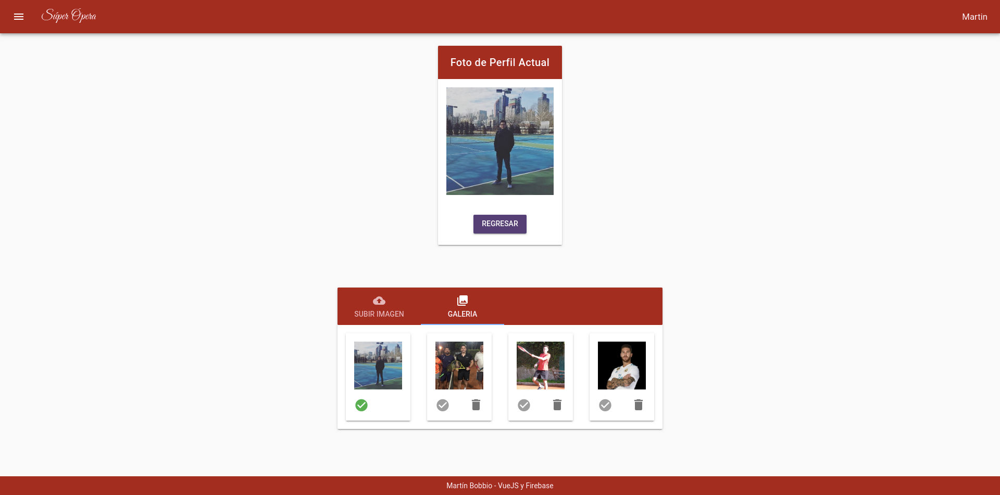

<h1 align="center">
   
  
    
  Aplicación de Teatros
   
</h1>

# Descripción
Tecnologias usadas: VueJS (vuex, vuetify y vuelidate) y Firebase(Database, Storage, Authenticacion y Hosting).
Autenticación interna, Google y Facebook.
Tambien cuenta con subida de imagenes y recorte de la misma en el perfil del usuario.

# Capturas

### Inicio

### Reservas

### Autenticacin

### Calendario

### Upload

